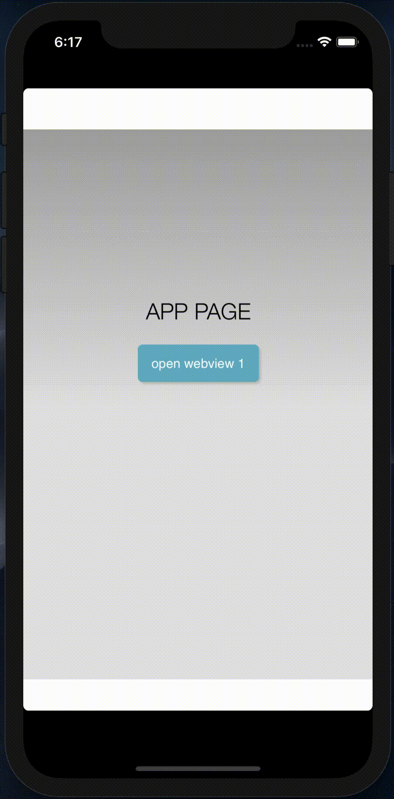

# cordova-plugin-openwebview

This plugin provide capability of open multiple webview, and you can open a new webview in sub webview page.


 English | [中文介绍](./README_zh.md)

## Screenshot




## Supported Platforms

- Android
- iOS


## Installation


```
cordova plugin add cordova-plugin-openwebview
```


## Methods

- cordova.plugins.openWebview.open
- window.webkit.messageHandlers.openNew.postMessage
- open system browser


## cordova.plugins.openWebview.open

```javascript
cordova.plugins.openWebview.open(openOptions, openSuccess, openError);
```


### Parameters

- openOptions 
- openSuccess
- openError 


#### openOptions

| Options           | Required | Data Type | Default Value | Description                                                  |
| ----------------- | -------- | --------- | ------------- | ------------------------------------------------------------ |
| ***url***         | true     | String    | *null*        | Target url open in webview, **not null**.                    |
| ***inSubView***   | false    | Boolean   | *false*       | Default open webview with full screen, if value is **true**, the effect will like demo. |
| ***showBackBtn*** | false    | Boolean   | *false*       | Default hide back button, if value is true, will show it.    |


### Example

```javascript
var openOptions = {
    url: "https://www.google.com",
    inSubView: false,
    showBackBtn: false
};

function openSuccess(data) {
    console.log(data);
}

function openError(error) {
    console.log(error);
}

cordova.plugins.openWebview.open(openOptions, openSuccess, openError);
```


## window.webkit.messageHandlers.openNew.postMessage

You can open a new webview in sub webview page, the method only have one option and same as openOptions.

**WARNING**: This method must be used in the webview which has been opened with cordova.plugins.openWebview.open.

### Example

```javascript
var openOptions = {
    url: "https://www.google.com",
    inSubView: false,
    showBackBtn: false
};

window.webkit.messageHandlers.openNew.postMessage(openOptions);
```


## Open url with system browser

If you want to open url with system browser, only need add  `#webview-external` to the end of url.

### Example

```javascript
var openOptions = {
    url: "https://www.google.com#webview-external"
};

cordova.plugins.openWebview.open(openOptions);

// or

window.webkit.messageHandlers.openNew.postMessage(openOptions);
```


## TODO

- [ ]  Custom action bar background color
- [ ]  Custom open webview sum（currently only two webviews can be opened）
- [ ]  Post custom message form sub webview


## Thanks

- [CustomIOSAlertView](https://github.com/wimagguc/ios-custom-alertview) 


## License

[MIT](https://opensource.org/licenses/MIT)

Copyright (c) 2020, Vason