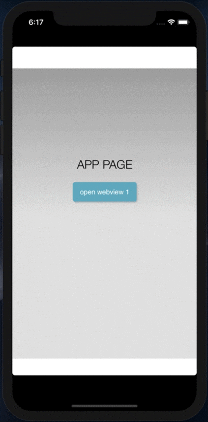

# cordova-plugin-openwebview

该插件给 Cordova App 提供打开多个 webview 的能力，也可以在一个已经打开的 webview 内部调用方法，打开一个子 webview，Demo 如下。


[English](./README.md) | 中文介绍


## 截图




## 支持平台

- Android
- iOS


## 安装


```
cordova plugin add cordova-plugin-openwebview
```


## 方法

- cordova.plugins.openWebview.open
- window.webkit.messageHandlers.openNew.postMessage
- 使用系统浏览器打开url


## cordova.plugins.openWebview.open

```javascript
cordova.plugins.openWebview.open(openOptions, openSuccess, openError);
```


### open参数

- openOptions
- openSuccess
- openError


#### openOptions

| openOptions参数   | Required | Data Typ | Default Value | Description                                                  |
| ----------------- | -------- | -------- | ------------- | ------------------------------------------------------------ |
| ***url***         | true     | String   | *null*        | 要使用插件打开的URL，**不能为空**                            |
| ***inSubView***   | false    | Boolean  | *false*       | 默认以全屏打开webview，如果值为 **true** 则效果如同截图所示。 |
| ***showBackBtn*** | false    | Boolean  | *false*       | 默认隐藏返回按钮，true 为显示.                               |


### 示例

```javascript
var openOptions = {
    url: "https://www.google.com",
    inSubView: false,
    showBackBtn: false
};

function openSuccess(data) {
    console.log(data);
}

function openError(error) {
    console.log(error);
}

cordova.plugins.openWebview.open(openOptions, openSuccess, openError);
```


## window.webkit.messageHandlers.openNew.postMessage

此方法可以在已经打开的webview中打开一个子 webview，需要传入一个参数，参数内容与 `openOptions` 一样。

注意：这个方法必须是在使用 `cordova.plugins.openWebview.open` 方法打开的 webview 中调用！

### 示例

```javascript
var openOptions = {
    url: "https://www.google.com",
    inSubView: false,
    showBackBtn: false
};

window.webkit.messageHandlers.openNew.postMessage(openOptions);
```


## 使用系统浏览器打开网页

如果想要调用系统浏览器打开网页，只需要在 url 的后面加上 `#webview-external`。

### 示例

```javascript
var openOptions = {
    url: "https://www.google.com#webview-external"
};

cordova.plugins.openWebview.open(openOptions);

// 以及

window.webkit.messageHandlers.openNew.postMessage(openOptions);
```


## 待完成

- [ ]  自定义操作栏背景色
- [ ]  自定义可打开的webview数量（当前只可打开两个webview）
- [ ]  从子webview发送自定义消息


## 感谢

- [CustomIOSAlertView](https://github.com/wimagguc/ios-custom-alertview) 


## License

[MIT](https://opensource.org/licenses/MIT)

Copyright (c) 2020, Vason